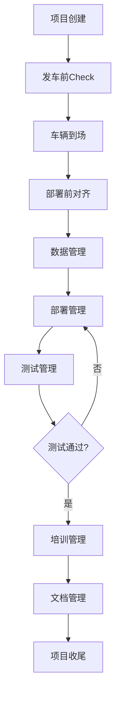

# 项目管理系统 - 产品需求文档 (PRD)

## 1. 产品概述

本项目是一个面向自动驾驶车辆部署场景的项目管理系统，旨在提供从发车前准备到项目收尾的全流程数字化管理。系统分为项目管理和现场部署两大模块，当前阶段优先实现项目管理模块，帮助团队高效管理车辆部署项目的各个环节，提升项目执行效率和质量管控能力。

**目标用户**: 自动驾驶车辆部署团队、项目经理、现场工程师、测试人员

**核心价值**: 实现项目全流程数字化管理，提升协作效率，确保部署质量，降低问题遗漏风险

## 2. 核心功能

### 2.1 功能模块概览

系统采用左侧导航栏 + 右侧内容区的经典布局，主要包含以下功能模块：

1. **项目导航**: 侧边栏项目管理，支持添加、删除、编辑项目
2. **发车前Check**: 发车清单、发车检查、发车问题、物流管理
3. **车辆到场**: 车辆到场检查、物料清单、缺失物料管理、问题管理
4. **部署前对齐**: 线路详情、难度分级、采集规范、传感器要求
5. **数据管理**: 采集数据管理、定位地图管理、批次管理
6. **部署管理**: 定位地图部署、路网版本管理、路网测试、功能项部署
7. **测试管理**: 测试项管理、测试用例、测试数据、参数管理、Bug管理
8. **培训管理**: 培训记录、附件管理、PDF生成
9. **文档管理**: 文档分类、超链接管理
10. **项目收尾**: 遗留问题、后续投入管理

### 2.2 页面详情

| 页面名称 | 模块名称 | 功能描述 |
|---------|---------|---------|
| 主界面 | 侧边栏导航 | 项目列表展示、添加/编辑/删除项目、项目切换 |
| 主界面 | 内容区域 | 根据选中模块动态展示对应功能页面 |
| 发车前Check | 发车清单 | 管理发车前的检查清单项目，支持勾选和状态跟踪 |
| 发车前Check | 发车检查 | 记录发车前的各项检查结果，支持文字描述 |
| 发车前Check | 发车问题 | 分类管理发车前问题、未解决问题、需现场解决的问题 |
| 发车前Check | 物流管理 | 物流单号录入、自动查询物流状态、跟踪物流信息 |
| 车辆到场 | 车辆到场检查 | 记录车辆到场后的检查项和结果 |
| 车辆到场 | 物料清单 | 管理车辆到场时的物料清单 |
| 车辆到场 | 缺失物料清单 | 记录和管理缺失物料信息 |
| 车辆到场 | 问题管理 | 车辆到场后的问题记录和跟踪 |
| 部署前对齐 | 线路详情 | 展示和编辑线路详细信息 |
| 部署前对齐 | 线路难度分级 | 线路难度评估（易/较难/难），记录难点说明 |
| 部署前对齐 | 采集规范要求 | 定义采集规范和标准 |
| 部署前对齐 | 传感器要求 | 采集传感器配置和要求 |
| 数据管理 | 采集数据管理 | 管理采集数据，支持批次管理 |
| 数据管理 | 定位地图管理 | 视觉定位、激光定位、语义定位地图管理 |
| 数据管理 | 批次管理 | 采集数据的分批次管理 |
| 部署管理 | 定位地图部署 | 定位地图部署检查清单（后期对接一键部署） |
| 部署管理 | 路网版本管理 | 路网版本控制和管理（后期对接部署工具） |
| 部署管理 | 路网测试管理 | 路网定位质量分析、迭代管理、测试log管理 |
| 部署管理 | 功能项部署管理 | 按产品类型（AET/BUS/UBOX）分类管理功能项部署 |
| 测试管理 | 测试项管理 | 路网测试、定位地图测试、功能项测试、安全性能测试、压力测试，自动生成报告 |
| 测试管理 | 测试用例管理 | 按车企标准管理测试用例，自动输出测试报告 |
| 测试管理 | 测试数据管理 | 测试log、问题截图等数据管理 |
| 测试管理 | 参数管理 | 按车、按版本管理参数配置 |
| 测试管理 | Bug管理 | 按车、按时间、按测试项管理Bug |
| 培训管理 | 培训记录 | 培训时间、人员、地点、内容管理，自动生成表格和PDF |
| 培训管理 | 附件管理 | 培训照片、视频附件管理 |
| 文档管理 | 文档分类管理 | 按项目分类管理文档，支持超链接 |
| 项目收尾 | 遗留问题管理 | 现场遗留问题记录和跟踪 |
| 项目收尾 | 后续投入管理 | 现场后续投入资源管理 |

## 3. 核心流程

### 3.1 项目创建流程

用户通过侧边栏创建新项目 → 填写项目基本信息（项目名称、类型、描述等） → 系统自动初始化项目各模块 → 用户进入项目开始管理

### 3.2 项目执行流程

### 3.3 数据流转流程

各模块产生的数据（问题、测试结果、文档等）在系统内流转，支持跨模块引用和关联，形成完整的项目数据链。

## 4. 用户界面设计

### 4.1 设计风格

**整体风格**: 现代化企业级管理系统，采用扁平化设计，强调功能性和易用性

**配色方案**:
- 主色调: 深蓝色 (#1E3A8A) - 体现专业性和可靠性
- 辅助色: 浅蓝色 (#3B82F6) - 用于交互元素
- 成功色: 绿色 (#10B981) - 表示完成状态
- 警告色: 橙色 (#F59E0B) - 表示待处理状态
- 错误色: 红色 (#EF4444) - 表示问题状态
- 背景色: 浅灰色 (#F3F4F6) - 降低视觉疲劳

**字体**:
- 标题字体: Source Sans Pro - 清晰易读
- 正文字体: Inter - 适合长时间阅读
- 代码字体: JetBrains Mono - 用于技术内容展示

**布局风格**:
- 左侧固定侧边栏（可折叠）
- 顶部导航栏（面包屑导航 + 用户信息）
- 主内容区采用卡片式布局
- 响应式设计，支持不同屏幕尺寸

**图标风格**: 使用 Lucide Icons，线条简洁，风格统一

### 4.2 页面设计概览

| 页面名称 | 模块名称 | UI元素 |
|---------|---------|--------|
| 主界面 | 侧边栏 | 固定左侧，宽度240px，项目列表垂直排列，底部添加按钮，深色背景 |
| 主界面 | 顶部导航 | 面包屑导航、全局搜索、通知图标、用户头像 |
| 主界面 | 内容区 | 白色背景卡片，圆角8px，阴影效果，模块标题+操作按钮 |
| 发车前Check | 发车清单 | 可勾选列表，状态标签，进度条显示完成度 |
| 发车前Check | 物流管理 | 表单输入框，物流状态卡片，时间轴展示 |
| 车辆到场 | 检查项 | 分组卡片，状态图标，备注输入框 |
| 部署前对齐 | 难度分级 | 选择器，条件展示难点说明区域 |
| 数据管理 | 数据列表 | 表格展示，筛选器，批次选择器，操作按钮 |
| 部署管理 | 功能项部署 | 产品类型标签页，功能项卡片列表，状态指示器 |
| 测试管理 | 测试报告 | 报告预览区，导出按钮，历史版本列表 |
| 培训管理 | 培训表单 | 表单字段，附件上传区，PDF预览/下载 |
| 文档管理 | 文档列表 | 树形结构，超链接卡片，搜索框 |
| 项目收尾 | 问题跟踪 | 问题列表，优先级标签，负责人分配 |

### 4.3 响应式设计

**桌面优先**: 主要针对桌面端设计，最小支持1366x768分辨率

**适配策略**:
- 侧边栏在小屏幕下可折叠为图标模式
- 内容区卡片自适应宽度
- 表格在小屏幕下支持横向滚动
- 弹窗和抽屉式组件适配不同屏幕

### 4.4 交互设计

**核心交互**:
- 侧边栏项目切换: 点击即可切换，当前项目高亮显示
- 模块导航: 顶部标签页或左侧二级导航
- 表单提交: 实时验证，友好错误提示
- 数据保存: 自动保存 + 手动保存双重机制
- 状态切换: 下拉选择或开关按钮
- 批量操作: 复选框 + 批量操作按钮

**动画效果**:
- 页面切换: 淡入淡出效果
- 卡片加载: 骨架屏动画
- 按钮点击: 轻微缩放反馈
- 列表项: 滑入动画

## 5. 数据管理策略

### 5.1 数据存储

**当前阶段**: 使用浏览器本地存储（LocalStorage）和IndexedDB存储项目数据

**数据结构**: JSON格式，支持导出和导入

**后期扩展**: 可对接后端API，实现云端同步和多用户协作

### 5.2 数据备份

- 支持项目数据导出为JSON文件
- 支持导入历史备份
- 关键操作前自动创建快照

## 6. 非功能性需求

### 6.1 性能要求

- 页面加载时间 < 2秒
- 列表渲染流畅，支持虚拟滚动
- 表单输入响应时间 < 100ms

### 6.2 可用性要求

- 界面简洁直观，新用户无需培训即可上手
- 关键操作提供确认提示
- 支持键盘快捷键

### 6.3 兼容性要求

- 操作系统: Ubuntu 20.04
- 浏览器: Chrome 90+, Firefox 88+
- 屏幕分辨率: 1366x768及以上

## 7. 后期扩展规划

### 7.1 现场部署模块

- 现场实时数据采集
- 移动端适配
- 离线模式支持

### 7.2 API对接

- 物流查询API对接
- 部署工具API对接
- 测试报告自动生成API
- 知识库检索API

### 7.3 高级功能

- 多用户协作
- 权限管理
- 数据统计分析
- 报表生成