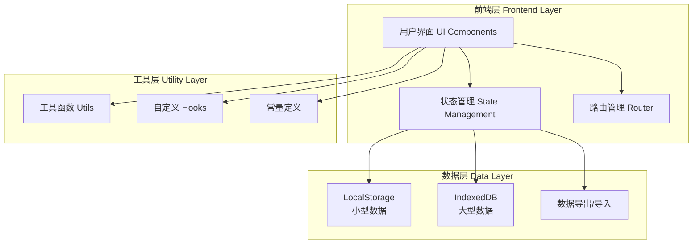
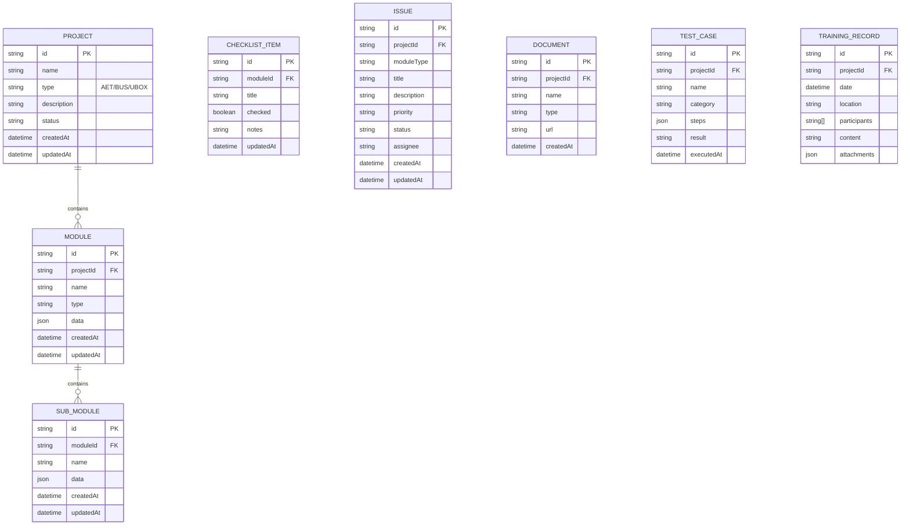

# 项目管理系统 - 技术架构文档

## 1. 架构设计



## 2. 技术栈

### 2.1 核心技术

* **前端框架**: React 18

* **开发语言**: TypeScript

* **构建工具**: Vite

* **样式方案**: Tailwind CSS 3

* **路由管理**: React Router v6

* **状态管理**: Zustand (轻量级状态管理)

* **图标库**: Lucide React

### 2.2 UI组件库

* **组件库**: 自定义组件 + Tailwind CSS

* **表单处理**: React Hook Form

* **表格组件**: TanStack Table (React Table v8)

* **拖拽功能**: @dnd-kit/core

* **PDF生成**: jspdf + html2canvas

* **日期处理**: date-fns

### 2.3 数据持久化

* **LocalStorage**: 存储项目列表、用户配置等小型数据

* **IndexedDB**: 存储大量项目数据、文件附件等

* **数据格式**: JSON

### 2.4 开发工具

* **代码规范**: ESLint + Prettier

* **类型检查**: TypeScript

* **包管理器**: npm

## 3. 项目结构

```
project-management-system/
├── public/                 # 静态资源
├── src/
│   ├── components/         # 可复用组件
│   │   ├── common/         # 通用组件
│   │   │   ├── Button/
│   │   │   ├── Input/
│   │   │   ├── Modal/
│   │   │   ├── Card/
│   │   │   └── Table/
│   │   ├── layout/         # 布局组件
│   │   │   ├── Sidebar/
│   │   │   ├── Header/
│   │   │   └── MainLayout/
│   │   └── modules/        # 业务模块组件
│   │       ├── PreDeparture/
│   │       ├── VehicleArrival/
│   │       ├── DeploymentAlignment/
│   │       ├── DataManagement/
│   │       ├── DeploymentManagement/
│   │       ├── TestManagement/
│   │       ├── TrainingManagement/
│   │       ├── DocumentManagement/
│   │       └── ProjectClosure/
│   ├── pages/              # 页面组件
│   │   ├── Home/
│   │   ├── Project/
│   │   └── Settings/
│   ├── stores/             # Zustand状态管理
│   │   ├── projectStore.ts
│   │   ├── moduleStore.ts
│   │   └── settingsStore.ts
│   ├── hooks/              # 自定义Hooks
│   │   ├── useLocalStorage.ts
│   │   ├── useIndexedDB.ts
│   │   └── useExport.ts
│   ├── utils/              # 工具函数
│   │   ├── storage.ts
│   │   ├── export.ts
│   │   └── validators.ts
│   ├── constants/          # 常量定义
│   │   ├── modules.ts
│   │   ├── status.ts
│   │   └── productTypes.ts
│   ├── types/              # TypeScript类型定义
│   │   ├── project.ts
│   │   ├── module.ts
│   │   └── common.ts
│   ├── styles/             # 全局样式
│   │   └── index.css
│   ├── App.tsx             # 根组件
│   └── main.tsx            # 入口文件
├── .eslintrc.js            # ESLint配置
├── .prettierrc             # Prettier配置
├── tailwind.config.js      # Tailwind配置
├── tsconfig.json           # TypeScript配置
├── vite.config.ts          # Vite配置
└── package.json            # 项目依赖
```

## 4. 路由定义

| 路由路径                                        | 页面组件                 | 说明            |
| ------------------------------------------- | -------------------- | ------------- |
| `/`                                         | Home                 | 首页，展示项目列表概览   |
| `/project/:projectId`                       | ProjectDetail        | 项目详情页，展示项目各模块 |
| `/project/:projectId/pre-departure`         | PreDeparture         | 发车前Check模块    |
| `/project/:projectId/vehicle-arrival`       | VehicleArrival       | 车辆到场模块        |
| `/project/:projectId/deployment-alignment`  | DeploymentAlignment  | 部署前对齐模块       |
| `/project/:projectId/data-management`       | DataManagement       | 数据管理模块        |
| `/project/:projectId/deployment-management` | DeploymentManagement | 部署管理模块        |
| `/project/:projectId/test-management`       | TestManagement       | 测试管理模块        |
| `/project/:projectId/training-management`   | TrainingManagement   | 培训管理模块        |
| `/project/:projectId/document-management`   | DocumentManagement   | 文档管理模块        |
| `/project/:projectId/project-closure`       | ProjectClosure       | 项目收尾模块        |
| `/settings`                                 | Settings             | 系统设置页         |

## 5. 数据模型

### 5.1 核心数据模型



### 5.2 数据类型定义

```typescript
// 项目类型
type ProjectType = 'AET' | 'BUS' | 'UBOX';

// 项目状态
type ProjectStatus = 'active' | 'completed' | 'paused';

// 项目接口
interface Project {
  id: string;
  name: string;
  type: ProjectType;
  description: string;
  status: ProjectStatus;
  createdAt: Date;
  updatedAt: Date;
}

// 模块类型
type ModuleType = 
  | 'pre-departure'
  | 'vehicle-arrival'
  | 'deployment-alignment'
  | 'data-management'
  | 'deployment-management'
  | 'test-management'
  | 'training-management'
  | 'document-management'
  | 'project-closure';

// 检查项接口
interface ChecklistItem {
  id: string;
  title: string;
  checked: boolean;
  notes?: string;
  updatedAt: Date;
}

// 问题接口
interface Issue {
  id: string;
  projectId: string;
  moduleType: ModuleType;
  title: string;
  description: string;
  priority: 'high' | 'medium' | 'low';
  status: 'open' | 'in-progress' | 'resolved' | 'closed';
  assignee?: string;
  createdAt: Date;
  updatedAt: Date;
}

// 物流信息接口
interface LogisticsInfo {
  id: string;
  trackingNumber: string;
  carrier: string;
  status: string;
  updates: LogisticsUpdate[];
}

interface LogisticsUpdate {
  time: Date;
  location: string;
  status: string;
}

// 测试用例接口
interface TestCase {
  id: string;
  projectId: string;
  name: string;
  category: 'road-network' | 'localization-map' | 'function' | 'safety' | 'stress';
  steps: TestStep[];
  result: 'pass' | 'fail' | 'pending';
  executedAt?: Date;
}

interface TestStep {
  step: number;
  action: string;
  expectedResult: string;
  actualResult?: string;
}

// 培训记录接口
interface TrainingRecord {
  id: string;
  projectId: string;
  date: Date;
  location: string;
  participants: string[];
  content: string;
  attachments: Attachment[];
}

interface Attachment {
  id: string;
  name: string;
  type: 'image' | 'video' | 'document';
  url: string;
  size: number;
}
```

## 6. 状态管理设计

### 6.1 项目状态管理 (projectStore)

```typescript
interface ProjectStore {
  projects: Project[];
  currentProject: Project | null;
  
  // Actions
  addProject: (project: Omit<Project, 'id' | 'createdAt' | 'updatedAt'>) => void;
  updateProject: (id: string, updates: Partial<Project>) => void;
  deleteProject: (id: string) => void;
  setCurrentProject: (project: Project | null) => void;
  loadProjects: () => void;
  saveProjects: () => void;
}
```

### 6.2 模块数据状态管理 (moduleStore)

```typescript
interface ModuleStore {
  moduleData: Record<string, any>;
  
  // Actions
  updateModuleData: (projectId: string, moduleType: ModuleType, data: any) => void;
  getModuleData: (projectId: string, moduleType: ModuleType) => any;
  loadModuleData: (projectId: string) => void;
  saveModuleData: (projectId: string) => void;
}
```

## 7. 核心功能实现方案

### 7.1 数据持久化

**LocalStorage方案**:

* 存储项目列表、用户配置等小型数据

* 容量限制约5MB

* 同步读写，性能较好

**IndexedDB方案**:

* 存储大量项目数据、文件附件

* 容量限制较大（通常>50MB）

* 异步读写，适合大数据量

**数据导出/导入**:

* 支持导出为JSON文件

* 支持导入历史备份

* 支持选择性导出（单个项目或全部数据）

### 7.2 PDF生成方案

使用 jspdf + html2canvas 实现：

```typescript
// 培训记录PDF生成示例
async function generateTrainingPDF(training: TrainingRecord) {
  const element = document.getElementById('training-content');
  const canvas = await html2canvas(element);
  const imgData = canvas.toDataURL('image/png');
  
  const pdf = new jsPDF('p', 'mm', 'a4');
  const imgWidth = 210;
  const imgHeight = (canvas.height * imgWidth) / canvas.width;
  
  pdf.addImage(imgData, 'PNG', 0, 0, imgWidth, imgHeight);
  pdf.save(`training-${training.id}.pdf`);
}
```

### 7.3 物流查询方案

**当前阶段**: 手动录入物流信息，支持填写单号和状态更新

**后期扩展**: 对接物流API（如快递100、快递鸟等），实现自动查询

### 7.4 测试报告生成

**当前阶段**: 基于模板生成HTML报告，支持导出PDF

**后期扩展**: 对接测试工具API，自动获取测试数据并生成报告

## 8. 性能优化策略

### 8.1 代码分割

* 路由级别懒加载

* 组件级别按需加载

* 第三方库按需引入

### 8.2 数据优化

* 虚拟滚动处理大列表

* 分页加载

* 数据缓存策略

### 8.3 渲染优化

* React.memo 减少不必要渲染

* useMemo/useCallback 优化计算和回调

* 防抖/节流处理频繁操作

## 9. 安全性考虑

### 9.1 数据安全

* 本地数据加密存储（可选）

* 敏感信息脱敏显示

* 数据备份机制

### 9.2 输入验证

* 表单输入验证

* XSS防护

* 数据格式校验

## 10. 部署方案

### 10.1 开发环境

```bash
# 安装依赖
npm install

# 启动开发服务器
npm run dev
```

### 10.2 生产构建

```bash
# 构建生产版本
npm run build

# 预览生产版本
npm run preview
```

### 10.3 桌面应用打包（可选）

后期可使用 Electron 打包为桌面应用：

```bash
# 安装Electron
npm install electron --save-dev

# 配置Electron主进程
# 打包为桌面应用
npm run electron:build
```

## 11. 后期扩展接口

### 11.1 API接口预留

```typescript
// API服务接口
interface APIService {
  // 项目管理
  getProjects: () => Promise<Project[]>;
  createProject: (project: Project) => Promise<Project>;
  updateProject: (id: string, updates: Partial<Project>) => Promise<Project>;
  deleteProject: (id: string) => Promise<void>;
  
  // 物流查询
  queryLogistics: (trackingNumber: string) => Promise<LogisticsInfo>;
  
  // 测试报告
  generateTestReport: (projectId: string) => Promise<Blob>;
  
  // 知识库检索
  searchKnowledge: (query: string) => Promise<SearchResult[]>;
}
```

### 11.2 后端对接方案

当需要对接后端时，只需：

1. 实现 APIService 接口
2. 修改状态管理中的数据加载逻辑
3. 添加网络请求错误处理

## 12. 开发计划

### 12.1 第一阶段（核心功能）

1. 项目基础架构搭建
2. 侧边栏项目管理功能
3. 发车前Check模块
4. 车辆到场模块
5. 基础数据存储和导出

### 12.2 第二阶段（扩展功能）

1. 部署前对齐模块
2. 数据管理模块
3. 部署管理模块
4. 测试管理模块

### 12.3 第三阶段（高级功能）

1. 培训管理模块（含PDF生成）
2. 文档管理模块
3. 项目收尾模块
4. 数据统计和分析

### 12.4 第四阶段（优化和扩展）

1. 性能优化
2. 用户体验优化
3. API对接
4. 桌面应用打包

